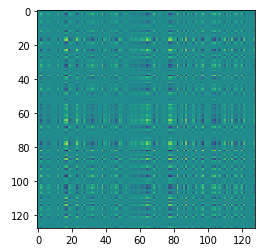
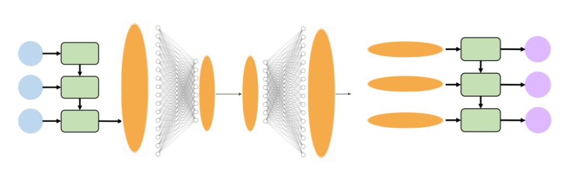
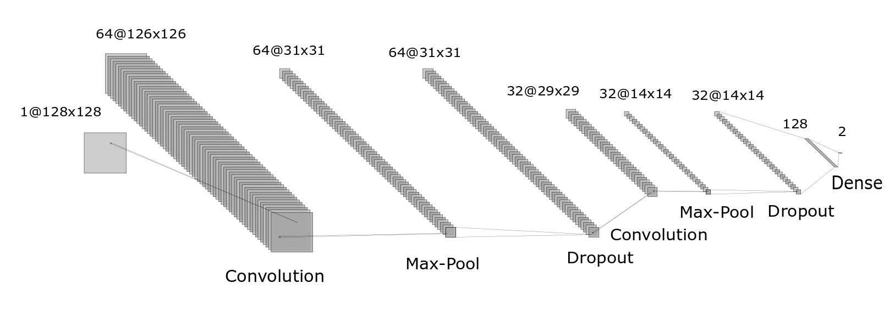
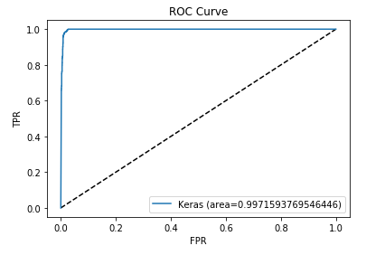
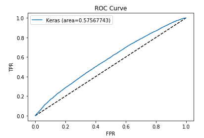

# Deep_PPI
## Protein-Protein Interaction Prediction with Deep Learning

We develop a framework to predict protein-protein interactions in humans. We learn a low-dimensional embedding of the protein sequences using an LSTM autoencoder, then use these embeddings to generate a unique "fingerprint" to represent the interaction. We then learn a deep CNN to predict interaction based on the fingerprints.

This repository includes a Jupyter / Google Colaboratory notebook for data download and processing, and model building and traning. It also includes the data used in the notebook, and trained models for the autoencoder, encoder, and CNN.

## Model Details

These models were built and trained using the [Keras](https://keras.io/) framework from the [Tensorflow](https://www.tensorflow.org/) package. Training and evaluation was done using human (*Homo sapiens*) protein interactions from the [STRING](https://string-db.org/) database.

### LSTM-AE
The LSTM autoencoder (LSTM-AE) is based on [this](https://machinelearningmastery.com/lstm-autoencoders/) tutorial by Jason Brownlee. It takes a protein sequence, passes it through a many-to-one LSTM layer, then several fully connected layers, the smallest of which is the central, 128-length embedding. It then scales the embedding back up, creates a sequence using a Keras [RepeatVector](https://www.tensorflow.org/api_docs/python/tf/keras/layers/RepeatVector) layer, then passes through a many-to-many LSTM which returns a protein sequence.

### CNN
The CNN is a deep convolutional network based on [this](https://machinelearningmastery.com/object-recognition-convolutional-neural-networks-keras-deep-learning-library/) tuturial by Jason Brownlee. It uses a series of Convolution, Max-Pool, and Dropout layers to learn hierarchical features of the fingerprint. It then uses a two dense layers, the final with two neurons and a softmax activation, to give the probabilities of interaction/no interaction.

## Evaluation

After training the LSTM-AE for 5 epochs and the CNN for 50 epochs, I was able to achieve ~96% training accuracy, ~94% test accuracy, and >99.7 AUROC.

However, I had less success when using the trained models to predict protein interactions from other species (yeast and fruit fly). The CNN AUROC was around 0.5 using the pretrained models, and only rose to about 0.57 using the pre-trained embedding, and retraining the CNN.

## Requirements

- Python 3.6+
- Tensorflow 2+
- Numpy
- Pandas

## References

- [A survey of current trends in computational predictions of protein-protein interactions](https://link.springer.com/article/10.1007/s11704-019-8232-z)
- [Sequence-based prediction of protein protein interaction using a deep-learning algorithm](https://bmcbioinformatics.biomedcentral.com/articles/10.1186/s12859-017-1700-2)
- [Simple sequence-based kernels do not predict protein-protein interactions](https://www.ncbi.nlm.nih.gov/pubmed/20801913)
